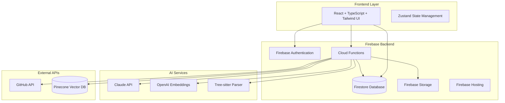

# Design Document: TechSensei AI Learning Platform

## Overview

TechSensei is an AI-powered solution that helps people learn faster, work smarter, and become more productive while building or understanding technology. The platform serves as an intelligent learning assistant and productivity tool that simplifies complex concepts, codebases, and workflows through AI-driven explanations, guided learning experiences, and smart development assistance.

The system architecture leverages Firebase for backend services, providing real-time capabilities, scalable data storage, and seamless authentication. The platform emphasizes clarity, usefulness, and meaningful AI enhancement of the learning and building experience through adaptive explanations, intelligent workflow assistance, and systematic skill development.

## Architecture

### High-Level Architecture



### Firebase-Centric Architecture

The system leverages Firebase as the primary backend platform, providing:

**Firebase Authentication**: Handles user registration, login, and OAuth integration with GitHub
**Firestore Database**: Stores user profiles, learning progress, repository analyses, and knowledge items
**Cloud Functions**: Serverless functions for AI processing, GitHub integration, and complex business logic
**Firebase Storage**: Stores user-generated content, cached analyses, and media files
**Firebase Hosting**: Serves the React application with global CDN distribution

**Key Architectural Benefits:**
- **Real-time Updates**: Firestore provides real-time synchronization for collaborative learning
- **Scalability**: Automatic scaling based on usage without infrastructure management
- **Security**: Built-in security rules and authentication integration
- **Offline Support**: Firestore offline capabilities for uninterrupted learning
- **Cost Efficiency**: Pay-per-use pricing model suitable for MVP and scaling

## Components and Interfaces

### Frontend Components

#### Core UI Components

```typescript
// Component hierarchy following atomic design principles
interface ComponentHierarchy {
  atoms: {
    Button: ButtonProps;
    Input: InputProps;
    Badge: BadgeProps;
    Icon: IconProps;
  };
  molecules: {
    SearchBar: SearchBarProps;
    CodeBlock: CodeBlockProps;
    ProgressIndicator: ProgressIndicatorProps;
    ExplanationCard: ExplanationCardProps;
  };
  organisms: {
    NavigationHeader: NavigationHeaderProps;
    ExplanationEngine: ExplanationEngineProps;
    CodebaseExplorer: CodebaseExplorerProps;
    LearningRoadmap: LearningRoadmapProps;
    KnowledgeVault: KnowledgeVaultProps;
  };
  templates: {
    DashboardLayout: DashboardLayoutProps;
    LearningLayout: LearningLayoutProps;
    AnalysisLayout: AnalysisLayoutProps;
  };
}
```

#### State Management Architecture

```typescript
// Zustand store structure for simplified state management
interface AppState {
  // Authentication state
  user: User | null;
  isAuthenticated: boolean;
  
  // UI state
  theme: 'light' | 'dark' | 'system';
  sidebarOpen: boolean;
  currentView: 'dashboard' | 'learn' | 'analyze' | 'knowledge' | 'profile';
  
  // Learning state
  currentRoadmap: LearningRoadmap | null;
  currentStep: number;
  learningSession: LearningSession | null;
  
  // Knowledge state
  searchResults: SearchResult[];
  selectedKnowledgeItem: KnowledgeItem | null;
  
  // Repository analysis state
  currentRepository: RepositoryAnalysis | null;
  analysisLoading: boolean;
  
  // Actions
  setUser: (user: User | null) => void;
  setTheme: (theme: 'light' | 'dark' | 'system') => void;
  toggleSidebar: () => void;
  setCurrentView: (view: string) => void;
  startLearningSession: (roadmap: LearningRoadmap) => void;
  updateProgress: (stepIndex: number) => void;
  searchKnowledge: (query: string) => Promise<void>;
  analyzeRepository: (repoUrl: string) => Promise<void>;
}

// Zustand store implementation
const useAppStore = create<AppState>((set, get) => ({
  // Initial state
  user: null,
  isAuthenticated: false,
  theme: 'system',
  sidebarOpen: true,
  currentView: 'dashboard',
  currentRoadmap: null,
  currentStep: 0,
  learningSession: null,
  searchResults: [],
  selectedKnowledgeItem: null,
  currentRepository: null,
  analysisLoading: false,
  
  // Actions
  setUser: (user) => set({ user, isAuthenticated: !!user }),
  setTheme: (theme) => set({ theme }),
  toggleSidebar: () => set((state) => ({ sidebarOpen: !state.sidebarOpen })),
  setCurrentView: (view) => set({ currentView: view }),
  
  startLearningSession: (roadmap) => set({
    currentRoadmap: roadmap,
    currentStep: 0,
    learningSession: {
      id: generateId(),
      roadmapId: roadmap.id,
      startTime: new Date(),
      activities: []
    }
  }),
  
  updateProgress: (stepIndex) => set((state) => ({
    currentStep: stepIndex,
    learningSession: state.learningSession ? {
      ...state.learningSession,
      activities: [
        ...state.learningSession.activities,
        {
          type: 'step_completed',
          timestamp: new Date(),
          data: { stepIndex }
        }
      ]
    } : null
  })),
  
  searchKnowledge: async (query) => {
    const results = await searchKnowledge({ query, userId: get().user?.uid });
    set({ searchResults: results });
  },
  
  analyzeRepository: async (repoUrl) => {
    set({ analysisLoading: true });
    try {
      const analysis = await analyzeRepository({ repoUrl, userId: get().user?.uid });
      set({ currentRepository: analysis, analysisLoading: false });
    } catch (error) {
      set({ analysisLoading: false });
      throw error;
    }
  }
}));
```

### Cloud Functions Architecture

#### AI-Powered Explanation Functions

```typescript
// Cloud Function for generating adaptive explanations
export const generateExplanation = functions.https.onCall(async (data, context) => {
  interface ExplanationRequest {
    topic: string;
    level: 'beginner' | 'intermediate' | 'advanced';
    preference: 'visual' | 'textual' | 'mixed';
    context?: string;
    userId: string;
  }

  interface ExplanationResponse {
    content: string;
    visualElements?: Array<{
      type: 'diagram' | 'flowchart' | 'code' | 'image';
      content: string;
      caption?: string;
    }>;
    relatedConcepts: string[];
    estimatedReadTime: number;
    difficulty: number;
    practicalApplications: string[];
  }
});

// Cloud Function for concept simplification
export const simplifyComplex = functions.https.onCall(async (data, context) => {
  interface SimplificationRequest {
    concept: string;
    userKnowledge: string[];
    targetLevel: 'beginner' | 'intermediate';
  }

  interface SimplificationResponse {
    simplifiedExplanation: string;
    analogies: string[];
    progressiveSteps: Array<{
      step: number;
      title: string;
      content: string;
      prerequisites: string[];
    }>;
    practicalExamples: string[];
    whyItMatters: string;
  }
});
```

#### Codebase Analysis Functions

```typescript
// Cloud Function for repository analysis
export const analyzeRepository = functions.https.onCall(async (data, context) => {
  interface RepositoryRequest {
    repoUrl: string;
    userId: string;
    analysisDepth: 'quick' | 'comprehensive';
  }

  interface RepositoryResponse {
    analysis: {
      overview: string;
      languages: Array<{ name: string; percentage: number }>;
      frameworks: string[];
      architecture: string;
      complexity: {
        score: number;
        factors: string[];
        recommendations: string[];
      };
      structure: {
        entryPoints: string[];
        keyFiles: string[];
        directories: Array<{ path: string; purpose: string }>;
      };
    };
    insights: {
      strengths: string[];
      improvementAreas: string[];
      learningOpportunities: string[];
    };
  }
});

// Cloud Function for dependency tracing
export const traceDependencies = functions.https.onCall(async (data, context) => {
  interface DependencyRequest {
    repoId: string;
    filePath: string;
    symbol?: string;
  }

  interface DependencyResponse {
    graph: {
      nodes: Array<{
        id: string;
        type: 'file' | 'function' | 'class' | 'variable';
        name: string;
        filePath: string;
      }>;
      edges: Array<{
        source: string;
        target: string;
        type: 'imports' | 'calls' | 'extends' | 'implements';
      }>;
    };
    insights: {
      circularDependencies: string[][];
      unusedCode: string[];
      suggestions: string[];
    };
  }
});
```

#### Learning and Workflow Functions

```typescript
// Cloud Function for generating learning roadmaps
export const generateRoadmap = functions.https.onCall(async (data, context) => {
  interface RoadmapRequest {
    topic: string;
    userLevel: 'beginner' | 'intermediate' | 'advanced';
    goals: string[];
    timeCommitment: number; // hours per week
    preferredStyle: 'project-based' | 'theory-first' | 'mixed';
  }

  interface RoadmapResponse {
    roadmap: {
      title: string;
      description: string;
      estimatedDuration: number;
      steps: Array<{
        id: string;
        title: string;
        description: string;
        type: 'concept' | 'practice' | 'project' | 'assessment';
        estimatedTime: number;
        resources: Array<{
          type: 'article' | 'video' | 'exercise' | 'project';
          title: string;
          url?: string;
          content?: string;
        }>;
        validation: {
          criteria: string[];
          checkpoints: string[];
        };
      }>;
    };
    skillTree: {
      prerequisites: string[];
      outcomes: string[];
      nextTopics: string[];
    };
  }
});

// Cloud Function for workflow assistance
export const assistWorkflow = functions.https.onCall(async (data, context) => {
  interface WorkflowRequest {
    currentTask: string;
    context: {
      codebase?: string;
      technologies: string[];
      userLevel: string;
    };
    blockers?: string[];
  }

  interface WorkflowResponse {
    suggestions: Array<{
      type: 'next-step' | 'optimization' | 'template' | 'automation';
      title: string;
      description: string;
      implementation: string;
      benefits: string[];
      difficulty: 'easy' | 'medium' | 'hard';
    }>;
    resources: Array<{
      title: string;
      type: 'documentation' | 'tutorial' | 'example';
      url: string;
      relevance: number;
    }>;
  }
});
```

#### Knowledge Management Functions

```typescript
// Cloud Function for intelligent knowledge organization
export const organizeKnowledge = functions.https.onCall(async (data, context) => {
  interface OrganizationRequest {
    userId: string;
    newContent?: {
      title: string;
      content: string;
      type: string;
    };
  }

  interface OrganizationResponse {
    skillTree: {
      nodes: Array<{
        id: string;
        concept: string;
        level: number;
        mastery: number;
        connections: string[];
      }>;
      paths: Array<{
        from: string;
        to: string;
        strength: number;
      }>;
    };
    recommendations: Array<{
      type: 'fill-gap' | 'advance' | 'practice' | 'review';
      concept: string;
      reason: string;
      resources: string[];
    }>;
    insights: {
      strengths: string[];
      gaps: string[];
      nextGoals: string[];
    };
  }
});

// Cloud Function for semantic search
export const searchKnowledge = functions.https.onCall(async (data, context) => {
  interface SearchRequest {
    query: string;
    userId: string;
    filters?: {
      type?: string[];
      difficulty?: string[];
      tags?: string[];
    };
    limit?: number;
  }

  interface SearchResponse {
    results: Array<{
      item: {
        id: string;
        title: string;
        content: string;
        type: string;
        tags: string[];
      };
      relevanceScore: number;
      explanation: string;
      matchedConcepts: string[];
      contextSnippet: string;
    }>;
    suggestions: {
      relatedQueries: string[];
      clarifyingQuestions: string[];
      alternativeTerms: string[];
    };
  }
});
```

## Data Models

### User and Profile Models

```typescript
interface User {
  id: string;
  email: string;
  username: string;
  profile: UserProfile;
  preferences: UserPreferences;
  progress: LearningProgress;
  createdAt: Date;
  updatedAt: Date;
}

interface UserProfile {
  displayName: string;
  avatar?: string;
  bio?: string;
  currentLevel: LearningLevel;
  skillAreas: SkillArea[];
  goals: LearningGoal[];
}

interface UserPreferences {
  contentPreference: ContentPreference;
  defaultLevel: LearningLevel;
  notificationSettings: NotificationSettings;
  themePreference: ThemePreference;
}

interface LearningProgress {
  completedRoadmaps: string[];
  currentRoadmaps: ActiveRoadmap[];
  skillLevels: Record<string, number>;
  achievements: Achievement[];
  totalLearningTime: number;
  streakDays: number;
}
```

### Content and Learning Models

```typescript
interface ContentItem {
  id: string;
  title: string;
  content: string;
  type: ContentType;
  level: LearningLevel;
  tags: string[];
  authorId: string;
  embedding: number[];
  metadata: ContentMetadata;
  createdAt: Date;
  updatedAt: Date;
}

interface LearningSession {
  id: string;
  userId: string;
  roadmapId: string;
  startTime: Date;
  endTime?: Date;
  completedSteps: string[];
  currentStep: string;
  notes: string;
  feedback: SessionFeedback;
}

interface CodebaseProject {
  id: string;
  userId: string;
  repoUrl: string;
  name: string;
  description: string;
  analysis: RepositoryAnalysis;
  bookmarks: CodeBookmark[];
  lastAccessed: Date;
}
```

### Vector Database Schema

```typescript
// Pinecone vector structure for semantic search
interface VectorRecord {
  id: string;
  values: number[]; // 1536-dimensional embedding from OpenAI
  metadata: {
    userId: string;
    contentType: ContentType;
    title: string;
    tags: string[];
    level: LearningLevel;
    createdAt: string;
    summary: string;
  };
}

interface SearchQuery {
  vector: number[];
  topK: number;
  filter?: {
    userId: string;
    contentType?: ContentType;
    level?: LearningLevel;
    tags?: string[];
  };
  includeMetadata: boolean;
}
```

### Database Schema (Firestore)

```typescript
// Firestore Collections Structure

// Users Collection
interface User {
  uid: string; // Firebase Auth UID
  email: string;
  displayName: string;
  photoURL?: string;
  profile: {
    currentLevel: 'beginner' | 'intermediate' | 'advanced';
    contentPreference: 'visual' | 'textual' | 'mixed';
    skillAreas: string[];
    goals: string[];
    createdAt: Timestamp;
    updatedAt: Timestamp;
  };
  preferences: {
    theme: 'light' | 'dark' | 'system';
    notifications: boolean;
    emailUpdates: boolean;
  };
  progress: {
    totalLearningTime: number;
    streakDays: number;
    completedRoadmaps: string[];
    skillLevels: Record<string, number>;
    lastActive: Timestamp;
  };
}

// Learning Roadmaps Collection
interface LearningRoadmap {
  id: string;
  title: string;
  description: string;
  category: string;
  difficulty: 'beginner' | 'intermediate' | 'advanced';
  estimatedDuration: number; // in minutes
  steps: LearningStep[];
  prerequisites: string[];
  outcomes: string[];
  createdBy: string; // user UID
  isPublic: boolean;
  tags: string[];
  createdAt: Timestamp;
  updatedAt: Timestamp;
}

// User Progress Subcollection (under users/{uid}/progress)
interface UserProgress {
  roadmapId: string;
  currentStepIndex: number;
  completedSteps: number[];
  startedAt: Timestamp;
  lastActivity: Timestamp;
  timeSpent: number; // in minutes
  notes: string;
  feedback: {
    rating?: number;
    comments?: string;
  };
}

// Knowledge Items Collection
interface KnowledgeItem {
  id: string;
  userId: string;
  title: string;
  content: string;
  type: 'explanation' | 'code_analysis' | 'summary' | 'note';
  tags: string[];
  category: string;
  difficulty: 'beginner' | 'intermediate' | 'advanced';
  vectorId?: string; // Pinecone vector ID
  metadata: {
    source?: string;
    language?: string;
    framework?: string;
    relatedConcepts: string[];
  };
  createdAt: Timestamp;
  updatedAt: Timestamp;
  accessCount: number;
  lastAccessed: Timestamp;
}

// Repository Analyses Collection
interface RepositoryAnalysis {
  id: string;
  userId: string;
  repoUrl: string;
  repoName: string;
  owner: string;
  description?: string;
  analysis: {
    languages: Array<{
      name: string;
      percentage: number;
      files: string[];
    }>;
    frameworks: string[];
    architecture: string;
    complexity: {
      totalFiles: number;
      totalLines: number;
      averageComplexity: number;
    };
    structure: {
      directories: string[];
      entryPoints: string[];
      configFiles: string[];
    };
    dependencies: {
      production: string[];
      development: string[];
      outdated: string[];
    };
  };
  bookmarks: Array<{
    filePath: string;
    lineNumber?: number;
    note: string;
    createdAt: Timestamp;
  }>;
  lastAnalyzed: Timestamp;
  createdAt: Timestamp;
}

// Learning Sessions Collection
interface LearningSession {
  id: string;
  userId: string;
  roadmapId?: string;
  type: 'roadmap' | 'exploration' | 'code_analysis' | 'explanation';
  startTime: Timestamp;
  endTime?: Timestamp;
  duration?: number; // in minutes
  activities: Array<{
    type: string;
    timestamp: Timestamp;
    data: any;
  }>;
  summary: {
    conceptsCovered: string[];
    skillsImproved: string[];
    achievements: string[];
  };
  feedback: {
    difficulty: number; // 1-5 scale
    usefulness: number; // 1-5 scale
    comments?: string;
  };
}
```

### Firestore Security Rules

```javascript
// Firestore Security Rules
rules_version = '2';
service cloud.firestore {
  match /databases/{database}/documents {
    // Users can read/write their own data
    match /users/{userId} {
      allow read, write: if request.auth != null && request.auth.uid == userId;
      
      // User progress subcollection
      match /progress/{progressId} {
        allow read, write: if request.auth != null && request.auth.uid == userId;
      }
    }
    
    // Public roadmaps are readable by all authenticated users
    match /roadmaps/{roadmapId} {
      allow read: if request.auth != null;
      allow write: if request.auth != null && 
        (request.auth.uid == resource.data.createdBy || 
         request.auth.uid == request.resource.data.createdBy);
    }
    
    // Knowledge items are private to users
    match /knowledge/{itemId} {
      allow read, write: if request.auth != null && 
        request.auth.uid == resource.data.userId;
    }
    
    // Repository analyses are private to users
    match /repositories/{repoId} {
      allow read, write: if request.auth != null && 
        request.auth.uid == resource.data.userId;
    }
    
    // Learning sessions are private to users
    match /sessions/{sessionId} {
      allow read, write: if request.auth != null && 
        request.auth.uid == resource.data.userId;
    }
  }
}
```

## Correctness Properties

*A property is a characteristic or behavior that should hold true across all valid executions of a system—essentially, a formal statement about what the system should do. Properties serve as the bridge between human-readable specifications and machine-verifiable correctness guarantees.*

### Property 1: Adaptive Explanation Generation
*For any* topic and user profile, when requesting an explanation, the generated content should match the user's specified learning level complexity and content preference format, with beginner content including foundational concepts and analogies, intermediate content including practical examples, and advanced content including technical depth and optimization considerations.
**Validates: Requirements 1.1, 1.2, 1.3, 1.4, 1.5, 1.6**

### Property 2: Explanation Consistency
*For any* sequence of related explanations within a learning session, terminology should remain consistent and concepts should build upon previously explained material without contradictions.
**Validates: Requirements 1.7**

### Property 3: Repository Analysis Completeness
*For any* valid GitHub repository URL, the analysis should successfully identify programming languages, frameworks, architectural patterns, and generate a comprehensive project overview including purpose, structure, and key components.
**Validates: Requirements 2.1, 2.2, 2.3**

### Property 4: Dependency Tracing Accuracy
*For any* code file or function in an analyzed repository, dependency tracing should identify all incoming and outgoing relationships with complete accuracy and present them in a clear visual format.
**Validates: Requirements 2.4, 2.5**

### Property 5: Analysis Persistence
*For any* completed repository analysis, the findings should be persistently stored and retrievable for future access with identical results.
**Validates: Requirements 2.6**

### Property 6: Learning Roadmap Generation
*For any* learning topic and user level, a structured sequence of building steps should be generated with clear objectives, expected outcomes, and success criteria for each step.
**Validates: Requirements 3.1, 3.2**

### Property 7: Step Validation and Feedback
*For any* learning step completion attempt, validation should occur against expected patterns, with specific feedback provided for failures and positive reinforcement for successes, enabling progression to the next step.
**Validates: Requirements 3.3, 3.4, 3.5**

### Property 8: Contextual Learning Assistance
*For any* help request during a learning step, contextual hints should be provided that guide without revealing complete solutions.
**Validates: Requirements 3.6**

### Property 9: Learning Session Persistence
*For any* interrupted learning session, progress should be saved and resumption should continue from the exact same point with all context preserved.
**Validates: Requirements 3.7**

### Property 10: Automatic Knowledge Summarization
*For any* completed learning session, a summary of covered concepts should be automatically generated and stored with appropriate tags and metadata for searchability.
**Validates: Requirements 4.1, 4.2**

### Property 11: Semantic Search Accuracy
*For any* search query in the knowledge vault, results should be ranked by semantic relevance rather than keyword matching, with highlighted terms and context snippets provided.
**Validates: Requirements 4.3, 4.4**

### Property 12: Knowledge Relationship Discovery
*For any* stored knowledge item, related concepts and connections to other stored knowledge should be identified and suggested when viewing the content.
**Validates: Requirements 4.5**

### Property 13: Summary Quality Preservation
*For any* content summarization, key technical details should be preserved while maintaining readability and comprehension.
**Validates: Requirements 4.6**

### Property 14: Usage-Based Content Prioritization
*For any* frequently accessed content, it should receive higher priority in search results and recommendations compared to less frequently accessed content.
**Validates: Requirements 4.7**

### Property 15: Comprehensive Code Analysis
*For any* submitted code, error identification, debugging guidance, refactoring suggestions, and code review should be provided with specific explanations and multiple solution options where applicable.
**Validates: Requirements 5.1, 5.2, 5.3, 5.5**

### Property 16: Functional Equivalence in Refactoring
*For any* refactoring suggestion, the modified code should maintain functional equivalence to the original while improving code structure and quality.
**Validates: Requirements 5.4**

### Property 17: Suggestion Prioritization
*For any* set of improvement suggestions, they should be prioritized and ordered by impact level and implementation difficulty.
**Validates: Requirements 5.6**

### Property 18: User Profile Initialization
*For any* new user account creation, initial learning level and content preference settings should be collected and stored.
**Validates: Requirements 6.1**

### Property 19: Adaptive Personalization
*For any* user interaction with content, engagement patterns and learning velocity should be tracked and used to adapt future content complexity and format.
**Validates: Requirements 6.2, 6.3**

### Property 20: Automatic Level Progression
*For any* user demonstrating mastery through performance metrics, automatic suggestions for advancing to higher difficulty levels should be provided.
**Validates: Requirements 6.4**

### Property 21: Struggle Detection and Remediation
*For any* user showing difficulty with concepts, additional foundational content and alternative explanations should be automatically provided.
**Validates: Requirements 6.5**

### Property 22: Comprehensive Progress Display
*For any* user progress view, learning achievements, skill development metrics, and areas for improvement should all be displayed.
**Validates: Requirements 6.6**

### Property 23: Secure GitHub Integration
*For any* GitHub account connection, OAuth authentication should be used and access credentials should be stored securely with proper permission validation.
**Validates: Requirements 7.1, 7.2, 7.3**

### Property 24: Efficient Repository Processing
*For any* repository analysis request, content should be cloned and processed efficiently without storing unnecessary data, with separate contexts maintained for multiple repositories.
**Validates: Requirements 7.4, 7.6**

### Property 25: Repository Change Detection
*For any* previously analyzed repository that has been updated, changes should be detected and refresh options should be offered to the user.
**Validates: Requirements 7.5**

### Property 26: Robust API Integration
*For any* Claude API interaction, appropriate content should be generated with retry logic for failures, rate limit handling with user notification, quality validation with regeneration for poor content, and input sanitization for security.
**Validates: Requirements 8.1, 8.2, 8.3, 8.4, 8.5**

### Property 27: API Response Caching
*For any* API response, appropriate content should be cached to reduce redundant API calls for similar requests.
**Validates: Requirements 8.6**

### Property 28: Multi-Language Code Parsing
*For any* source code in supported programming languages, tree-sitter should accurately parse and extract functions, classes, imports, relationships, and design patterns, with meaningful error handling for parsing failures.
**Validates: Requirements 9.1, 9.2, 9.3, 9.4**

### Property 29: Scalable Code Processing
*For any* large codebase, files should be parsed incrementally to maintain responsive performance without degradation.
**Validates: Requirements 9.5**

### Property 30: Parsing Ambiguity Handling
*For any* ambiguous code syntax, reasonable assumptions should be made and parsing decisions should be documented.
**Validates: Requirements 9.6**

### Property 31: Semantic Vector Search Pipeline
*For any* content indexing and search operation, vector embeddings should be generated using semantic understanding, queries should be converted to vector representations, and results should be ranked by semantic similarity with relevance explanations.
**Validates: Requirements 10.1, 10.2, 10.3, 10.6**

### Property 32: Vector Embedding Maintenance
*For any* content update, vector embeddings should be refreshed to maintain search accuracy.
**Validates: Requirements 10.4**

### Property 33: Search Query Disambiguation
*For any* ambiguous search query, clarifying questions or alternative search terms should be suggested to improve search effectiveness.
**Validates: Requirements 10.5**

## Error Handling

### API Error Handling Strategy

The system implements a comprehensive error handling strategy for external API integrations:

**Claude API Error Handling:**
- **Rate Limiting**: Implement exponential backoff with jitter for rate limit responses
- **Timeout Handling**: Set appropriate timeouts (30s for content generation) with graceful degradation
- **Content Validation**: Validate API responses for completeness and appropriateness before serving to users
- **Fallback Mechanisms**: Provide cached or simplified responses when API is unavailable

**GitHub API Error Handling:**
- **Authentication Errors**: Clear error messages for expired or invalid tokens with re-authentication prompts
- **Permission Errors**: Graceful handling of private repository access with user-friendly explanations
- **Repository Not Found**: Validate repository existence and accessibility before analysis attempts
- **API Quota Management**: Track and display API quota usage with warnings before limits

### Data Processing Error Handling

**Tree-sitter Parsing Errors:**
- **Syntax Errors**: Provide meaningful error messages with line numbers and suggestions
- **Unsupported Languages**: Graceful degradation with basic text analysis when language parsers unavailable
- **Large File Handling**: Implement streaming parsing for large files with progress indicators
- **Memory Management**: Prevent memory exhaustion with file size limits and incremental processing

**Vector Database Errors:**
- **Connection Failures**: Retry logic with exponential backoff for Pinecone connectivity issues
- **Indexing Errors**: Queue failed indexing operations for retry with user notification
- **Search Timeouts**: Provide partial results when search operations exceed time limits
- **Embedding Generation Failures**: Fallback to keyword search when vector embeddings unavailable

### User Experience Error Handling

**Progressive Error Recovery:**
- **Graceful Degradation**: Maintain core functionality when non-critical services fail
- **User Feedback**: Provide clear, actionable error messages without technical jargon
- **Retry Mechanisms**: Allow users to retry failed operations with one-click retry buttons
- **Offline Capabilities**: Cache critical data for limited offline functionality

**Data Consistency:**
- **Transaction Management**: Use database transactions for multi-step operations
- **Conflict Resolution**: Handle concurrent user modifications with last-write-wins or merge strategies
- **Backup and Recovery**: Implement automated backups with point-in-time recovery capabilities

## Testing Strategy

### Dual Testing Approach

The TechSensei platform requires both unit testing and property-based testing to ensure comprehensive coverage and correctness:

**Unit Testing Focus:**
- **API Integration Points**: Test specific API request/response scenarios with mocked services
- **Edge Cases**: Test boundary conditions like empty repositories, malformed code, invalid user inputs
- **Error Conditions**: Test specific error scenarios like network failures, authentication errors, parsing failures
- **Component Integration**: Test interactions between frontend components and backend services
- **Database Operations**: Test CRUD operations, transaction handling, and data consistency

**Property-Based Testing Focus:**
- **Universal Correctness**: Verify that properties hold across all possible inputs using randomized test data
- **Adaptive Behavior**: Test that explanations adapt correctly across all learning levels and content preferences
- **Semantic Consistency**: Verify that search results maintain semantic relevance across diverse query types
- **Code Analysis Accuracy**: Test parsing and analysis accuracy across various programming languages and code patterns
- **User Personalization**: Verify that personalization adapts correctly based on user interaction patterns

### Property-Based Testing Configuration

**Testing Framework**: Use **fast-check** for JavaScript/TypeScript property-based testing
- **Minimum Iterations**: Each property test must run at least 100 iterations due to randomization
- **Custom Generators**: Create domain-specific generators for:
  - Learning topics and levels
  - Code snippets in multiple languages
  - Repository structures and metadata
  - User interaction patterns
  - Search queries and content types

**Property Test Tagging**: Each property-based test must include a comment referencing its design document property:
```typescript
// Feature: techsensei, Property 1: Adaptive Explanation Generation
test('explanation generation adapts to user level and preferences', () => {
  fc.assert(fc.property(
    fc.record({
      topic: fc.string(),
      level: fc.constantFrom('beginner', 'intermediate', 'advanced'),
      preference: fc.constantFrom('visual', 'textual', 'mixed')
    }),
    async (input) => {
      const explanation = await explanationEngine.generate(input);
      expect(explanation.level).toBe(input.level);
      expect(explanation.format).toMatch(input.preference);
    }
  ));
});
```

### Integration Testing Strategy

**End-to-End User Flows:**
- **Learning Journey**: Test complete learning roadmap from topic selection to completion
- **Repository Analysis**: Test full repository analysis workflow from URL input to dependency visualization
- **Knowledge Management**: Test content creation, storage, search, and retrieval workflows
- **Personalization**: Test adaptive behavior across multiple user sessions

**Performance Testing:**
- **Load Testing**: Test system behavior under concurrent user load
- **Scalability Testing**: Verify performance with large repositories and extensive knowledge bases
- **API Rate Limit Testing**: Test graceful handling of external API limitations
- **Memory Usage Testing**: Verify efficient memory usage during large file processing

**Security Testing:**
- **Input Validation**: Test protection against malicious inputs and prompt injection
- **Authentication Testing**: Verify OAuth flows and session management
- **Authorization Testing**: Test proper access control for private repositories and user data
- **Data Privacy**: Verify user data isolation and secure storage practices